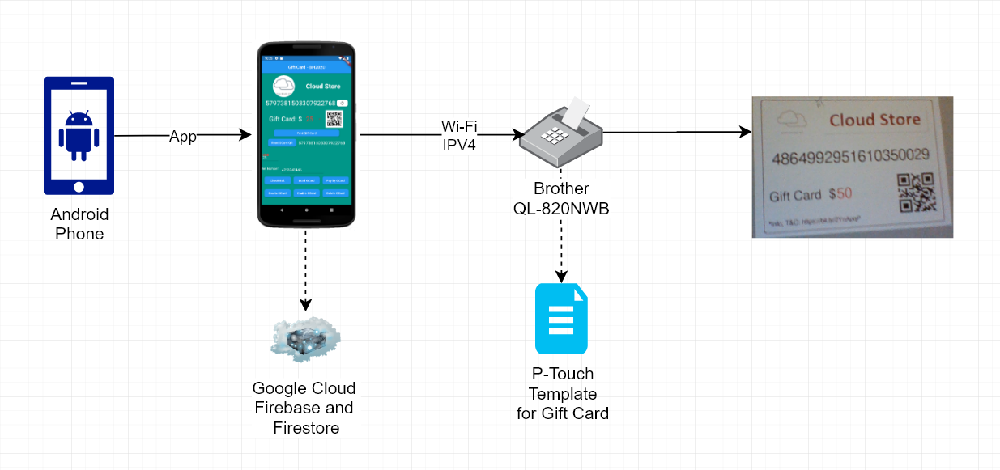

# giftcard
Gift Card Android application developed for Brother Hackathon 2020.
## Goal
Social good application to support local businesses for introducing gift cards of their own store with their existing resources.
### Pre-requisites
- Android smartphone with a version higher than Lollipop
- Brother label printer QL-820NWB
  - If there is no availability of the said label printer, then use some website (like https://www.online-qrcode-generator.com/) for generating QR code of the gift card number and print it for customer using any regular printer with a gift card template (created using any document software). You may use the attached gift card template word document as well.
### Block diagram

### Technology
- Flutter + Dart
- Firebase; Firestore Native Database
- Brother P-Touch editor for label printer templates
- Flutter plug-ins like Brother Label Printer, QR code creator and scanner
### Shared files
- GiftCard-good.lbx (Label printer P-Touch template)
- giftcard-v1-main.dart (Flutter Dart file)
- Don't forget to include additional files in flutter project
  - Store logo and refresh icon images
  - google-services file for connecting to firebase
